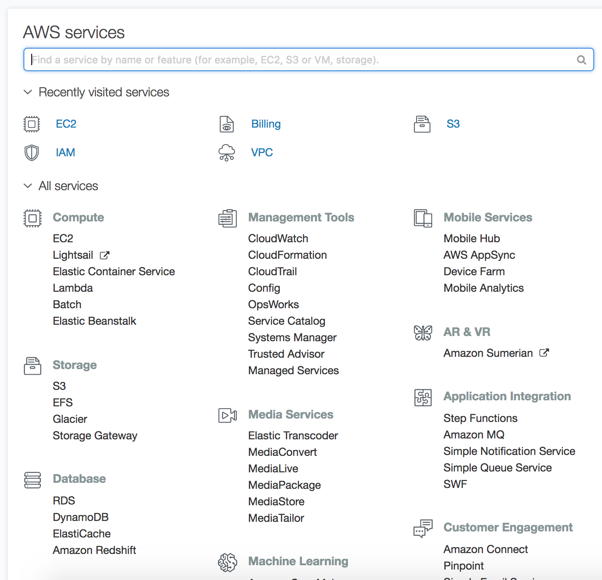

# Lesson 04 - Upload a Static Website with S3 

## The Walkthrough

1. Sign in to AWS Management Console and open the Amazon S3 console at https://console.aws.amazon.com/s3/.   




2. Create a bucket.
    * Click the Create Bucket Button
    
     * On the Name and Region page, type a name for your bucket and choose the AWS Region where you want the bucket to reside.
    
    * Click Next, and on the Set properties page, you can configure the following properties for the bucket. Or, you can configure these properties later, after you create the bucket.
    
     * Click Next, on the Set permissions page, you manage the permissions that are set on the bucket that you are creating. You can grant read access to your bucket to the general public (everyone in the world). Granting public read access is not common but would be applicable when buckets are used for websites. 
     
     * Click Next, on the Review page, verify the settings. If you want to change something, choose Edit. If your current settings are correct, choose Create bucket.

3. Open the bucket Properties pane, choose Static Website Hosting, and do the following:

    * Choose Enable website hosting.
    * In the Index Document box, type the name of your index document. The name is typically index.html.
    * Choose Save to save the website configuration.
    * Write down the Endpoint. This is the Amazon S3-provided website endpoint for your bucket. You use this endpoint in the following steps to test your website.

4. Add Bucket Policy
	
    * In the Properties pane for the bucket, choose Permissions.
    * Choose Add Bucket Policy.
    * Copy the following bucket policy, and then paste it in the Bucket Policy Editor.
    * In the policy, replace example-bucket with the name of your bucket.
    * Choose Save.
    
```json
{
   "Version":"2012-10-17",
   "Statement":[{
 	"Sid":"PublicReadForGetBucketObjects",
        "Effect":"Allow",
        "Principal": "*",
       "Action":["s3:GetObject"],
       "Resource":["arn:aws:s3:::example-bucket/*"
       ]
     }
   ]
 }
```


5. Uploading a Home Page

	* Create an html document named index.html. Give it the same name that you gave the index document earlier.
	
	* Return to your list of buckets on S3. Open your bucket. Click the button to upload the document to your bucket.
6. Testing Your Website

	* Type the following URL in the browser, replacing *example-bucket* with the name of your bucket and *website-region* with the name of the AWS Region where you deployed your bucket.

```
http://example-bucket.s3-website-region.amazonaws.com
```

If your browser displays your index.html page, the website was successfully deployed.

### Note

HTTPS access to the website is not supported.
You now have a website hosted on Amazon S3. This website is available at the Amazon S3 website endpoint. However, you might have a domain, such as example.com, that you want to use to serve the content from the website you created. You might also want to use Amazon S3 root domain support to serve requests for both

## What's Going On

The software you are downloading are the things you will need to write, compile and deploy java applications from your own machine.
