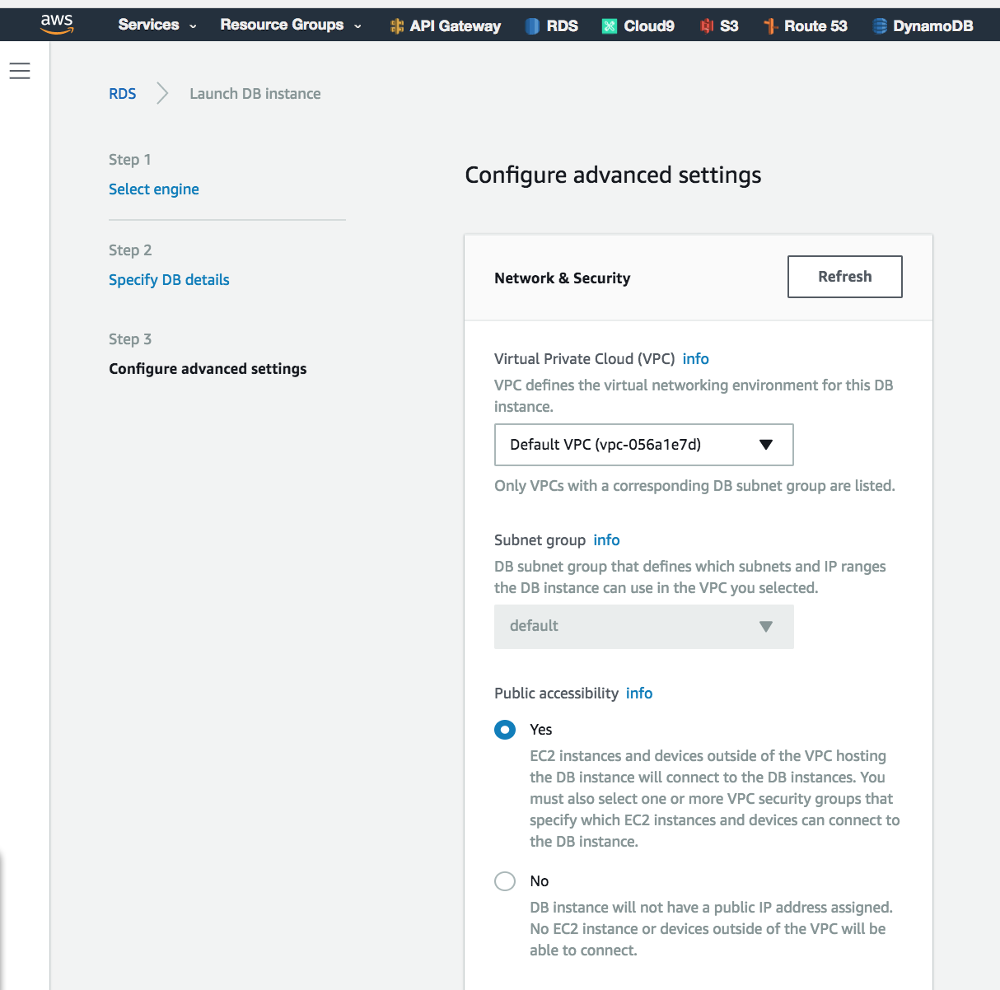
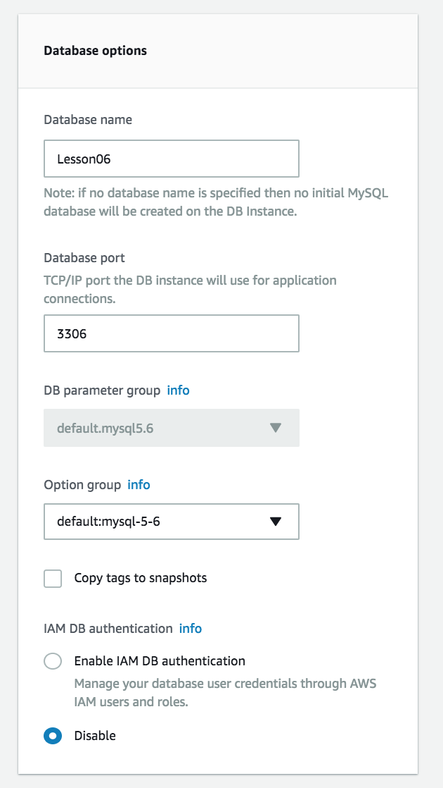
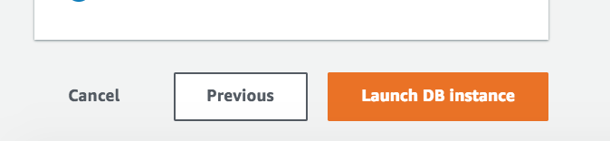
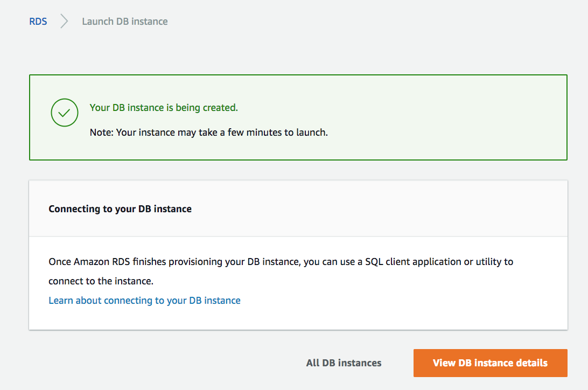
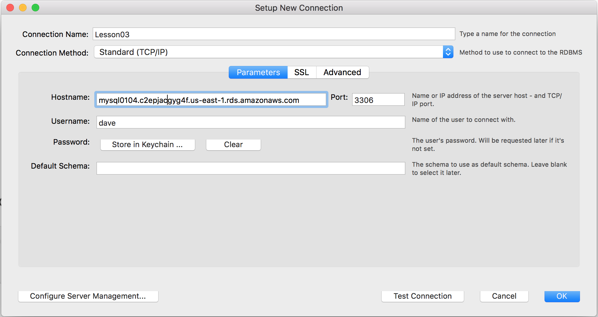
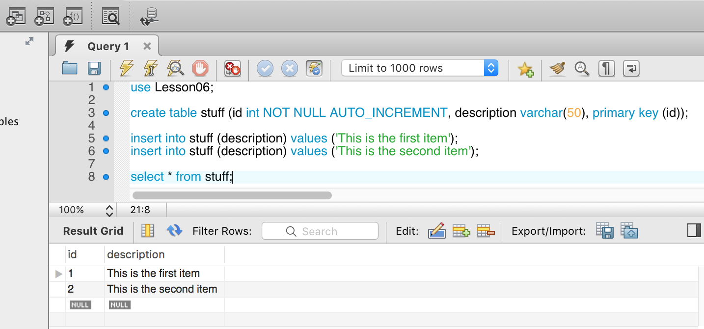
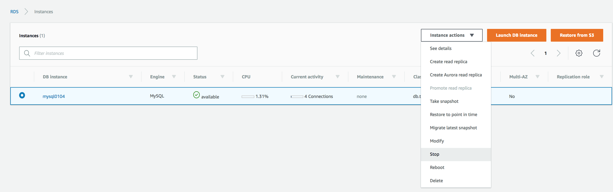

# Lesson 06 - Set up a MySQL database with RDS

Amazon Relational Database Service (Amazon RDS) makes it easy to set up, operate, and scale relational databases in the cloud. It provides cost-efficient and resizable capacity while managing time-consuming database administration tasks, freeing you up to focus on your applications and business.

## Prerequisites
* Install MySQL Workbench on your computer
    * See: ```https://dev.mysql.com/downloads/workbench/``` for details

## Learning Objectives

* Create a publicly-accessible MySQL database on AWS
* Connect to MySQL from a locally-installed instance of MySQL Workbench
* Create a database, a table and insert some data

## The Walkthrough

First you will set up the database on AWS but you won't create any tables or add any data. Secondly, you'll connect with MySQL workbench. From there you'll run a script to create a database, a table and add some data.

### Set up the database

1. Login to the Amazon dashboard
2. Go to the *RDS Dashboard*
3. Click on the *Get Started Now* button
4. Select MySQL
5. Click *Next*
6. Scroll down to settings
7. Provide database specific details and **write them down**:
   * db instance name ________________
   * username ________________
   * password ________________
8. Click *Next* to configure some advanced settings
  
9. Make sure Public accessibility is selected
10. Scroll down to `Database Options` and complete the following and **write them down**:
    * Database Name _________________
    * Database Port: 3306
    * IAM DB authentication should be `No`
  
11. Other settings on this page can remain as their defaults
12. Click the orange *Launch DB Instance* button

13. On the next page you'll see a message that your instance is being created
  
14. Click the orange button to view the details. The details will update once the instance is created.
15. Once it's available, write down your endpoint. You'll need it for MySQL Workbench.
    * Endpoint: ______________________


### Connect with MySQL Workbench

1. Open MySQL Workbench on your local computer
2. Click the Plus Sign to Add a New Connection
3. The *Setup New Connection* dialog will display

  

4. Enter the following information which you wrote down from above:
    * Connection Name
    * Hostname (this is the endpoint from above)
    * Username
    * Password
5. Click 'Test Connection' to make sure you entered everything correctly
6. Click 'OK'. You'll return to the opening screen of MySQL Workbench.
7. Click on the connection name to open the 'SQL Editor'


### Create a database, add a table and add some data

1. Run the following script to create a database


```sql
use Lesson06;

create table stuff (id int NOT NULL AUTO_INCREMENT, description varchar(50), primary key (id));

insert into stuff (description) values ('This is the first item');
insert into stuff (description) values ('This is the second item');

select * from stuff;
```

2. If you want to create other database tables or users you can now perform those activities from MySQL Workbench. You can use MySQL Workbench as if the database were hosted locally.

> You can find example SQL commands at ```https://www.w3schools.com/sql/```

## What You Will See

  


> When you are done.... go back to *instances* and select the option to 'Stop your Db Instance'. This will prevent you from being billed for a database you aren't using.

  


## What's Going On?


## Questions
