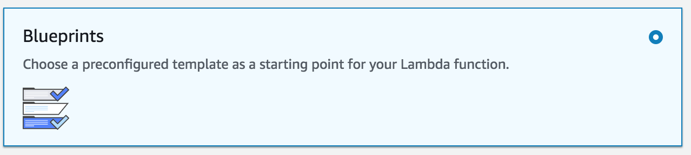
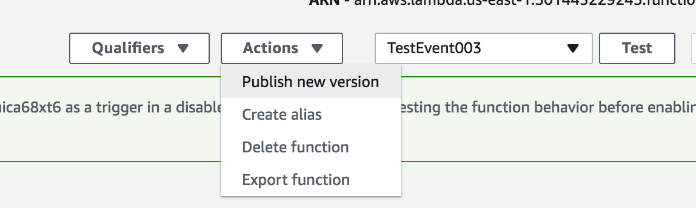
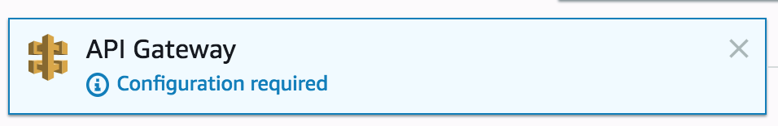
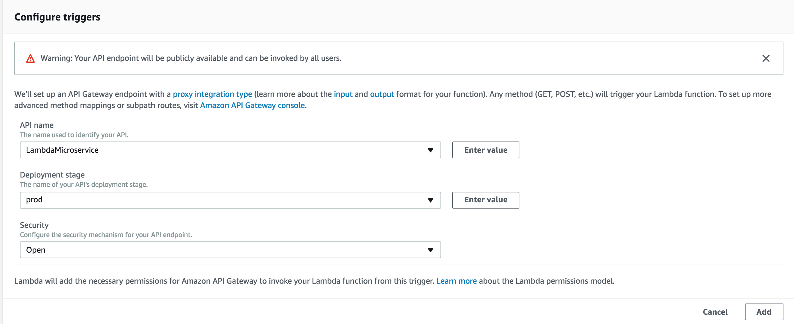
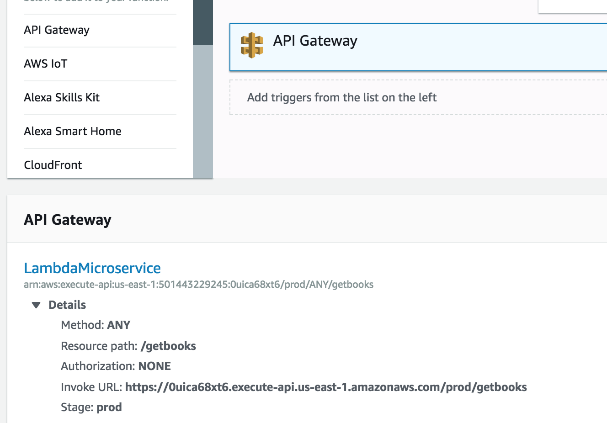

# Lesson 10 - Create and Host a REST API with Lambda


## The Walkthrough

### Create a new Lambda function and an API Gateway endpoint to trigger it

1. Sign in to the AWS Management Console and open the AWA Lambda console at ```https://console.aws.amazon.com/lambda/home```

2. Click on the button labeled 'Create Function' and then select 'Blueprints'. (Be sure you click so as to select the radio button at the upper-right of Blueprints)


3. The page will change and you can enter *microservice-http-endpoint-python*. in the filter box below the Blueprints option above.

4. Click the ```microservice-http-endpoint-python``` link and complete the next page with the following values:
 * Name - getbooks
 * Role - Choose an existing role
 * Existing role - service-role/basicexecution
 * API name - LambdaMicroservice
 * Deployment state - prod
 * Security - Open

5. Continue to scroll down below the **Lambda function code**. You'll be able to replace that code after you save the lambda funciton.

6. Click [Create function] and your happy congratulation message will display. Now you can edit the function so it works the way you want it to work. Replace everything in the code text box with the following.

```python
    import json

    def respond(err, res=None):
        return {
            'statusCode': '400' if err else '200',
            'body': err.message if err else res,
            'headers': {
                'Content-Type': 'application/json',
            },
        }


    def lambda_handler(event, context):
        courses = [
            {
              "title": "Angular Intro",
              "instructor": "Smithers",
              "credit": 3,
              "id": 1
            },
            {
              "title": "Spring Intro",
              "instructor": "Simpson",
              "credit": 3,
              "id": 2
            }
          ]
        return respond(None,courses)
```
7. Click *Save*

8. Click *Test*. Accept all the defaults and enter a name for the test event. Click *Test* and see the result... it passed. If not, edit the python code until it works.

9. Click on *Actions* at the top of the page and select *Publish New Version*.



10. On the next page, look for the blue box that says *API Gateway*. If you don't see it then look in the listbox along the left of the page and select API Gateway.



11. Now scroll down in this page and configure the trigger that fires and returns your function when the API endpoint is hit.



12. Click the *Add* button at the bottom of the page.

13. Click the *Save* button at the top of the next page.

14. Once the function is saved you can test it again and make sure there are not any errors. Then click on the button for *API Gateway* in the middle of the page. You'll be able to scroll down to find your endpoint URL (labeled Invoke URL) and paste that in a browser to view the result.




## What's Going On?

A web service is a method of exchanging data with remote servers using http operations. To get data from the server, use http GET. To send data to the server, use http POST.
It is also possible to create, modify and delete data using using http PUT and http DELETE. And if we call a function then we can even make our data interchage more dynamic!

The advantage of web services is their simplicity and the ability to exchange data between different systems. The most common format for exchanging data is XML or JSON.

## Questions
